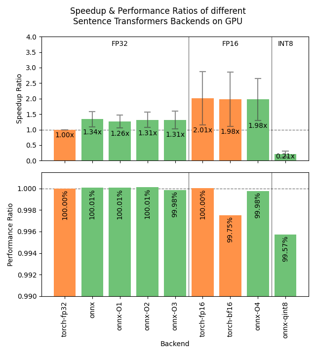
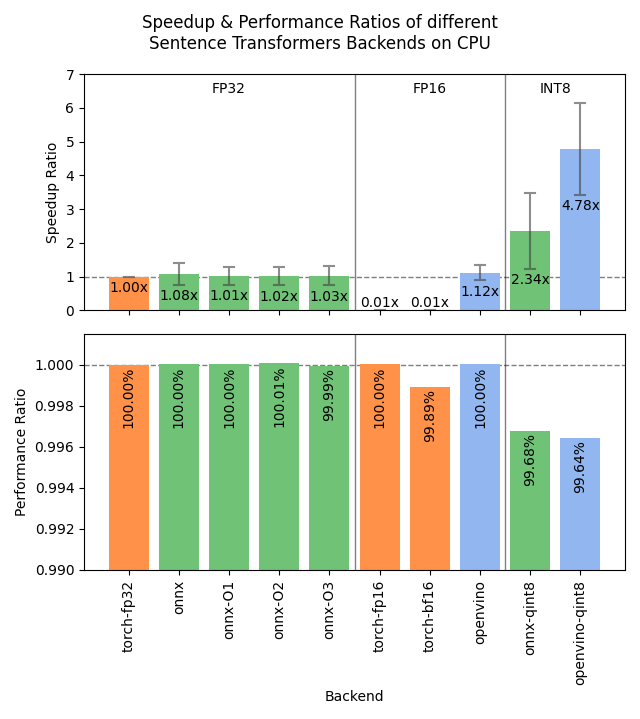

Speeding up Inference
=====================

.. seealso::
   This page focuses on backend-level optimizations (ONNX, OpenVINO, model quantization). For complementary techniques that reduce storage and search cost at the embedding level, see the `Binary and Scalar Embedding Quantization for Significantly Faster & Cheaper Retrieval <https://huggingface.co/blog/embedding-quantization>`_ blogpost (post-training compression of output vectors), the `🪆 Introduction to Matryoshka Embedding Models <https://huggingface.co/blog/matryoshka>`_ blogpost (truncatable embeddings), and the `Train 400x faster Static Embedding Models <https://huggingface.co/blog/static-embeddings>`_ blogpost (attention-free CPU-friendly models).

Sentence Transformers supports 3 backends for computing embeddings, each with its own optimizations for speeding up inference:

.. raw:: html

    

        <a href="#pytorch" class="box">
            
PyTorch

            The default backend for Sentence Transformers.
        </a>
        <a href="#onnx" class="box">
            
ONNX

            Flexible and efficient model accelerator.
        </a>
        <a href="#openvino" class="box">
            
OpenVINO

            Optimization of models, mainly for Intel Hardware.
        </a>
        <a href="#benchmarks" class="box">
            
Benchmarks

            Benchmarks for the different backends.
        </a>
        <a href="#user-interface" class="box">
            
User Interface

            GUI to export, optimize, and quantize models.
        </a>
    

     

PyTorch
-------

The PyTorch backend is the default backend for Sentence Transformers. If you don't specify a device, it will use the strongest available option across "cuda", "mps", and "cpu". Its default usage looks like this:

.. code-block:: python

   from sentence_transformers import SentenceTransformer
   
   model = SentenceTransformer("sentence-transformers/all-MiniLM-L6-v2")

   sentences = ["This is an example sentence", "Each sentence is converted"]
   embeddings = model.encode(sentences)

If you're using a GPU, then you can use the following options to speed up your inference:

.. tab:: float16 (fp16)

   Float32 (fp32, full precision) is the default floating-point format in ``torch``, whereas float16 (fp16, half precision) is a reduced-precision floating-point format that can speed up inference on GPUs at a minimal loss of model accuracy. To use it, you can specify the ``torch_dtype`` during initialization or call :meth:`model.half() <torch.Tensor.half>` on the initialized model:

   .. code-block:: python

      from sentence_transformers import SentenceTransformer

      model = SentenceTransformer("sentence-transformers/all-MiniLM-L6-v2", model_kwargs={"torch_dtype": "float16"})
      # or: model.half()

      sentences = ["This is an example sentence", "Each sentence is converted"]
      embeddings = model.encode(sentences)

.. tab:: bfloat16 (bf16)

   Bfloat16 (bf16) is similar to fp16, but preserves more of the original accuracy of fp32. To use it, you can specify the ``torch_dtype`` during initialization or call :meth:`model.bfloat16() <torch.Tensor.bfloat16>` on the initialized model:

   .. code-block:: python

      from sentence_transformers import SentenceTransformer

      model = SentenceTransformer("sentence-transformers/all-MiniLM-L6-v2", model_kwargs={"torch_dtype": "bfloat16"})
      # or: model.bfloat16()

      sentences = ["This is an example sentence", "Each sentence is converted"]
      embeddings = model.encode(sentences)

.. tab:: Flash Attention

   `Flash Attention <https://github.com/Dao-AILab/flash-attention>`_ is an efficient attention implementation that can significantly
   speed up inference on GPUs. When flash attention with variable-length support is available, Sentence Transformers automatically
   skips padding for text-only inputs by concatenating them into a single sequence. This eliminates the overhead of padding shorter
   texts to the longest text in the batch, which is especially beneficial when input lengths vary widely.

   To use flash attention, specify ``attn_implementation="flash_attention_2"`` in ``model_kwargs``. Flash attention can be installed
   via ``pip install kernels``, which provides flash attention support without needing the ``flash-attn`` package, or alternatively
   via ``pip install flash-attn``:

   .. code-block:: python

      from sentence_transformers import SentenceTransformer

      model = SentenceTransformer(
          "sentence-transformers/all-MiniLM-L6-v2",
          model_kwargs={"attn_implementation": "flash_attention_2", "torch_dtype": "bfloat16"},
      )

      sentences = ["This is an example sentence", "Each sentence is converted"]
      embeddings = model.encode(sentences)

   .. note::

      Automatic input unpadding requires ``transformers >= 5.0.0`` and is enabled by default when flash attention
      with variable-length support is installed and compatible with the model architecture. You can control this
      via :attr:`~sentence_transformers.base.modules.transformer.Transformer.unpad_inputs` on the underlying
      :class:`~sentence_transformers.base.modules.transformer.Transformer` module:

      .. code-block:: python

         model[0].unpad_inputs = False   # Force padding (e.g. for architectures that don't support unpadded inputs)
         model[0].unpad_inputs = True    # Explicitly request unpadding
         model[0].unpad_inputs = None    # Auto-detect (default)

   The following benchmark compares throughput and VRAM usage across three attention configurations using
   `BAAI/bge-base-en-v1.5 <https://huggingface.co/BAAI/bge-base-en-v1.5>`_, averaged across batch sizes.
   Four datasets with varying text lengths are tested.

   .. image:: ../../img/benchmark_fa2_unpadding.png
      :alt: Flash Attention 2 Input Flattening Benchmark
      :width: 100%

   Flash Attention 2 with input flattening always outperforms standard Flash Attention 2, while using considerably less VRAM. The gains grow with the variance in input length, with the mixed dataset with wildly varying lengths (10-500 tokens) benefitting the most.

   Input flattening also speeds up training. When training with a gradient-cached loss such as
   :class:`~sentence_transformers.sentence_transformer.losses.CachedMultipleNegativesRankingLoss`, you can additionally set
   ``mini_batch_num_tokens`` instead of ``mini_batch_size``. Mini-batches are then packed by total token count
   rather than by sequence count, so every mini-batch performs a similar amount of work and uses a similar,
   predictable amount of memory, regardless of how sequence lengths are distributed within the batch. This can
   substantially increase training throughput on datasets with varying text lengths:

   .. code-block:: python

      from sentence_transformers import SentenceTransformer, losses

      model = SentenceTransformer(
          "answerdotai/ModernBERT-base",
          model_kwargs={"attn_implementation": "flash_attention_2", "torch_dtype": "bfloat16"},
      )
      loss = losses.CachedMultipleNegativesRankingLoss(model, mini_batch_num_tokens=32768)

   Prefer the smallest budget that saturates your GPU: throughput plateaus beyond that point, and budgets that
   push peak memory close to the card's limit gain little and can silently slow training down when the driver
   spills to system RAM instead of erroring.

   .. seealso::

      The `Transformers Attention Interface <https://huggingface.co/docs/transformers/en/attention_interface>`_ documentation
      for a full overview of available ``attn_implementation`` options, including ``"flash_attention_2"``,
      ``"flash_attention_3"``, ``"sdpa"``, and more.

.. tab:: torch.compile

   :meth:`model.compile() <sentence_transformers.base.model.BaseModel.compile>` wraps the model's forward pass with
   :func:`torch.compile`. Whether it helps depends strongly on the model and hardware: the benefit grows with model
   size, and very small models on a fast GPU can see little gain or even a slight slowdown, since their inference is
   dominated by tokenization and Python overhead. Always measure on your own model, hardware, and inputs. It composes
   with the fp16/bf16 options above.

   .. code-block:: python

      from sentence_transformers import SentenceTransformer

      model = SentenceTransformer("sentence-transformers/all-MiniLM-L6-v2", model_kwargs={"torch_dtype": "bfloat16"})
      model.compile(dynamic=True)

      sentences = ["This is an example sentence", "Each sentence is converted"]
      embeddings = model.encode(sentences)

   ``dynamic=True`` enables dynamic shapes so a compiled graph can handle variable sequence lengths, reducing
   recompilation when your inputs vary in length. For the largest speedup, use ``mode="reduce-overhead"`` instead:
   it applies CUDA graphs to remove the per-kernel launch overhead that dominates batch-size-1 inference.

   .. code-block:: python

      model.compile(mode="reduce-overhead")

   However, CUDA graphs capture one graph per input shape, so they need stable shapes. Pad every input to a fixed
   length near your typical length by passing ``padding="max_length"`` through ``processing_kwargs`` when encoding:

   .. code-block:: python

      embeddings = model.encode(sentences, processing_kwargs={"text": {"padding": "max_length", "max_length": 256}})

   ``max_length`` sets the fixed length that shorter inputs are padded up to and longer inputs are truncated down to.
   It is optional and defaults to the tokenizer's ``model_max_length``.

   Padding up to a large ``model_max_length`` (for example 8192) makes every call process the full length and is slower
   than not compiling at all. CUDA graphs also reuse output buffers, so clone anything you keep across calls (the
   default ``convert_to_numpy=True`` already copies off the GPU and is safe). Compilation is lazy, so warm the model
   up on representative inputs before benchmarking or serving.

.. note::

   When running a Sentence Transformers model alongside a generative LLM on the same GPU, keep an eye on VRAM usage and generation latency, as the two can contend for memory and compute. For latency-sensitive local setups, moving small embedding models to the CPU can help (e.g. ``SentenceTransformer(..., device="cpu")`` or ``model.encode(..., device="cpu")``).

ONNX
----

.. include:: backend_export_sidebar.rst

ONNX can be used to speed up inference by converting the model to ONNX format and using ONNX Runtime to run the model. To use the ONNX backend, you must install Sentence Transformers with the ``onnx`` or ``onnx-gpu`` extra for CPU or GPU acceleration, respectively:

.. code-block:: bash

   pip install sentence-transformers[onnx-gpu]
   # or
   pip install sentence-transformers[onnx]

To convert a model to ONNX format, you can use the following code:

.. code-block:: python

   from sentence_transformers import SentenceTransformer

   model = SentenceTransformer("sentence-transformers/all-MiniLM-L6-v2", backend="onnx")
   
   sentences = ["This is an example sentence", "Each sentence is converted"]
   embeddings = model.encode(sentences)

If the model path or repository already contains a model in ONNX format, Sentence Transformers will automatically use it. Otherwise, it will convert the model to the ONNX format. 

.. note::

   If you wish to use the ONNX model outside of Sentence Transformers, you'll need to perform pooling and/or normalization yourself. The ONNX export only converts the Transformer component, which outputs token embeddings, not sentence embeddings. To get sentence embeddings, you'll need to apply the appropriate pooling strategy (like mean pooling) and any normalization that the original model uses.

All keyword arguments passed via ``model_kwargs`` will be passed on to :meth:`ORTModel.from_pretrained <optimum.onnxruntime.ORTModel.from_pretrained>`. Some notable arguments include:

* ``provider``: ONNX Runtime provider to use for loading the model, e.g. ``"CPUExecutionProvider"`` . See https://onnxruntime.ai/docs/execution-providers/ for possible providers. If not specified, the strongest provider (E.g. ``"CUDAExecutionProvider"``) will be used.
* ``file_name``: The name of the ONNX file to load. If not specified, will default to ``"model.onnx"`` or otherwise ``"onnx/model.onnx"``. This argument is useful for specifying optimized or quantized models.
* ``export``: A boolean flag specifying whether the model will be exported. If not provided, ``export`` will be set to ``True`` if the model repository or directory does not already contain an ONNX model.

.. tip::

   It's heavily recommended to save the exported model to prevent having to re-export it every time you run your code. You can do this by calling :meth:`model.save_pretrained() <sentence_transformers.sentence_transformer.model.SentenceTransformer.save_pretrained>` if your model was local:

   .. code-block:: python

      model = SentenceTransformer("path/to/my/model", backend="onnx")
      model.save_pretrained("path/to/my/model")
   
   or with :meth:`model.push_to_hub() <sentence_transformers.sentence_transformer.model.SentenceTransformer.push_to_hub>` if your model was from the Hugging Face Hub:

   .. code-block:: python

      model = SentenceTransformer("intfloat/multilingual-e5-small", backend="onnx")
      model.push_to_hub("intfloat/multilingual-e5-small", create_pr=True)

Optimizing ONNX Models
^^^^^^^^^^^^^^^^^^^^^^

.. include:: backend_export_sidebar.rst

ONNX models can be optimized using `Optimum <https://huggingface.co/docs/optimum/index>`_, allowing for speedups on CPUs and GPUs alike. To do this, you can use the :func:`~sentence_transformers.backend.export_optimized_onnx_model` function, which saves the optimized in a directory or model repository that you specify. It expects:

- ``model``: a Sentence Transformer, Sparse Encoder, or Cross Encoder model loaded with the ONNX backend.
- ``optimization_config``: ``"O1"``, ``"O2"``, ``"O3"``, or ``"O4"`` representing optimization levels from :class:`~optimum.onnxruntime.AutoOptimizationConfig`, or an :class:`~optimum.onnxruntime.OptimizationConfig` instance.
- ``model_name_or_path``: a path to save the optimized model file, or the repository name if you want to push it to the Hugging Face Hub.
- ``push_to_hub``: (Optional) a boolean to push the optimized model to the Hugging Face Hub.
- ``create_pr``: (Optional) a boolean to create a pull request when pushing to the Hugging Face Hub. Useful when you don't have write access to the repository.
- ``file_suffix``: (Optional) a string to append to the model name when saving it. If not specified, the optimization level name string will be used, or just ``"optimized"`` if the optimization config was not just a string optimization level.

See this example for exporting a model with :doc:`optimization level 3 <optimum-onnx:onnxruntime/usage_guides/optimization>` (basic and extended general optimizations, transformers-specific fusions, fast Gelu approximation):

.. tab:: Hugging Face Hub Model

   Only optimize once::

      from sentence_transformers import SentenceTransformer, export_optimized_onnx_model

      model = SentenceTransformer("sentence-transformers/all-MiniLM-L6-v2", backend="onnx")
      export_optimized_onnx_model(
          model=model,
          optimization_config="O3",
          model_name_or_path="sentence-transformers/all-MiniLM-L6-v2",
          push_to_hub=True,
          create_pr=True,
      )

   Before the pull request gets merged::

      from sentence_transformers import SentenceTransformer

      pull_request_nr = 2 # NOTE: Update this to the number of your pull request
      model = SentenceTransformer(
          "sentence-transformers/all-MiniLM-L6-v2",
          backend="onnx",
          model_kwargs={"file_name": "onnx/model_O3.onnx"},
          revision=f"refs/pr/{pull_request_nr}"
      )
   
   Once the pull request gets merged::

      from sentence_transformers import SentenceTransformer

      model = SentenceTransformer(
          "sentence-transformers/all-MiniLM-L6-v2",
          backend="onnx",
          model_kwargs={"file_name": "onnx/model_O3.onnx"},
      )

.. tab:: Local Model

   Only optimize once::

      from sentence_transformers import SentenceTransformer, export_optimized_onnx_model

      model = SentenceTransformer("path/to/my/mpnet-legal-finetuned", backend="onnx")
      export_optimized_onnx_model(
          model=model, optimization_config="O3", model_name_or_path="path/to/my/mpnet-legal-finetuned"
      )

   After optimizing::

      from sentence_transformers import SentenceTransformer

      model = SentenceTransformer(
          "path/to/my/mpnet-legal-finetuned",
          backend="onnx",
          model_kwargs={"file_name": "onnx/model_O3.onnx"},
      )

Quantizing ONNX Models
^^^^^^^^^^^^^^^^^^^^^^

.. include:: backend_export_sidebar.rst

ONNX models can be quantized to int8 precision using `Optimum <https://huggingface.co/docs/optimum/index>`_, allowing for faster inference on CPUs. To do this, you can use the :func:`~sentence_transformers.backend.export_dynamic_quantized_onnx_model` function, which saves the quantized in a directory or model repository that you specify. Dynamic quantization, unlike static quantization, does not require a calibration dataset. It expects:

- ``model``: a Sentence Transformer, Sparse Encoder, or Cross Encoder model loaded with the ONNX backend.
- ``quantization_config``: ``"arm64"``, ``"avx2"``, ``"avx512"``, or ``"avx512_vnni"`` representing quantization configurations from :class:`~optimum.onnxruntime.AutoQuantizationConfig`, or an :class:`~optimum.onnxruntime.QuantizationConfig` instance.
- ``model_name_or_path``: a path to save the quantized model file, or the repository name if you want to push it to the Hugging Face Hub.
- ``push_to_hub``: (Optional) a boolean to push the quantized model to the Hugging Face Hub.
- ``create_pr``: (Optional) a boolean to create a pull request when pushing to the Hugging Face Hub. Useful when you don't have write access to the repository.
- ``file_suffix``: (Optional) a string to append to the model name when saving it. If not specified, ``"qint8_quantized"`` will be used.

On my CPU, each of the default quantization configurations (``"arm64"``, ``"avx2"``, ``"avx512"``, ``"avx512_vnni"``) resulted in roughly equivalent speedups.

See this example for quantizing a model to ``int8`` with :doc:`avx512_vnni <optimum-onnx:onnxruntime/usage_guides/quantization>`:

.. tab:: Hugging Face Hub Model

   Only quantize once::

      from sentence_transformers import SentenceTransformer, export_dynamic_quantized_onnx_model

      model = SentenceTransformer("sentence-transformers/all-MiniLM-L6-v2", backend="onnx")
      export_dynamic_quantized_onnx_model(
          model=model,
          quantization_config="avx512_vnni",
          model_name_or_path="sentence-transformers/all-MiniLM-L6-v2",
          push_to_hub=True,
          create_pr=True,
      )

   Before the pull request gets merged::

      from sentence_transformers import SentenceTransformer

      pull_request_nr = 2 # NOTE: Update this to the number of your pull request
      model = SentenceTransformer(
          "sentence-transformers/all-MiniLM-L6-v2",
          backend="onnx",
          model_kwargs={"file_name": "onnx/model_qint8_avx512_vnni.onnx"},
          revision=f"refs/pr/{pull_request_nr}",
      )
   
   Once the pull request gets merged::

      from sentence_transformers import SentenceTransformer

      model = SentenceTransformer(
          "sentence-transformers/all-MiniLM-L6-v2",
          backend="onnx",
          model_kwargs={"file_name": "onnx/model_qint8_avx512_vnni.onnx"},
      )

.. tab:: Local Model

   Only quantize once::

      from sentence_transformers import SentenceTransformer, export_dynamic_quantized_onnx_model

      model = SentenceTransformer("path/to/my/mpnet-legal-finetuned", backend="onnx")
      export_dynamic_quantized_onnx_model(
          model=model, quantization_config="avx512_vnni", model_name_or_path="path/to/my/mpnet-legal-finetuned"
      )

   After quantizing::

      from sentence_transformers import SentenceTransformer

      model = SentenceTransformer(
          "path/to/my/mpnet-legal-finetuned",
          backend="onnx",
          model_kwargs={"file_name": "onnx/model_qint8_avx512_vnni.onnx"},
      )

OpenVINO
--------

.. include:: backend_export_sidebar.rst

OpenVINO allows for accelerated inference on CPUs by exporting the model to the OpenVINO format. To use the OpenVINO backend, you must install Sentence Transformers with the ``openvino`` extra:

.. code-block:: bash

   pip install sentence-transformers[openvino]

To convert a model to OpenVINO format, you can use the following code:

.. code-block:: python

   from sentence_transformers import SentenceTransformer

   model = SentenceTransformer("sentence-transformers/all-MiniLM-L6-v2", backend="openvino")
   
   sentences = ["This is an example sentence", "Each sentence is converted"]
   embeddings = model.encode(sentences)

If the model path or repository already contains a model in OpenVINO format, Sentence Transformers will automatically use it. Otherwise, it will convert the model to the OpenVINO format.

.. note::

   If you wish to use the OpenVINO model outside of Sentence Transformers, you'll need to perform pooling and/or normalization yourself. The OpenVINO export only converts the Transformer component, which outputs token embeddings, not sentence embeddings. To get sentence embeddings, you'll need to apply the appropriate pooling strategy (like mean pooling) and any normalization that the original model uses.

.. raw:: html

   All keyword arguments passed via <code>model_kwargs</code> will be passed on to <a href="https://huggingface.co/docs/optimum/intel/openvino/reference#optimum.intel.openvino.modeling_base.OVBaseModel.from_pretrained"><code style="color: #404040; font-weight: 700;">OVBaseModel.from_pretrained()</code></a>. Some notable arguments include:

* ``file_name``: The name of the ONNX file to load. If not specified, will default to ``"openvino_model.xml"`` or otherwise ``"openvino/openvino_model.xml"``. This argument is useful for specifying optimized or quantized models.
* ``export``: A boolean flag specifying whether the model will be exported. If not provided, ``export`` will be set to ``True`` if the model repository or directory does not already contain an OpenVINO model.

.. tip::

   It's heavily recommended to save the exported model to prevent having to re-export it every time you run your code. You can do this by calling :meth:`model.save_pretrained() <sentence_transformers.sentence_transformer.model.SentenceTransformer.save_pretrained>` if your model was local:

   .. code-block:: python

      model = SentenceTransformer("path/to/my/model", backend="openvino")
      model.save_pretrained("path/to/my/model")
   
   or with :meth:`model.push_to_hub() <sentence_transformers.sentence_transformer.model.SentenceTransformer.push_to_hub>` if your model was from the Hugging Face Hub:

   .. code-block:: python

      model = SentenceTransformer("intfloat/multilingual-e5-small", backend="openvino")
      model.push_to_hub("intfloat/multilingual-e5-small", create_pr=True)

Quantizing OpenVINO Models
^^^^^^^^^^^^^^^^^^^^^^^^^^

.. include:: backend_export_sidebar.rst

OpenVINO models can be quantized to int8 precision using `Optimum Intel <https://huggingface.co/docs/optimum/main/en/intel/index>`_ to speed up inference.
To do this, you can use the :func:`~sentence_transformers.backend.export_static_quantized_openvino_model` function,
which saves the quantized model in a directory or model repository that you specify.
Post-Training Static Quantization expects:

- ``model``: a Sentence Transformer, Sparse Encoder, or Cross Encoder model loaded with the OpenVINO backend.
- ``quantization_config``: (Optional) The quantization configuration. This parameter accepts either:
  ``None`` for the default 8-bit quantization, a dictionary representing quantization configurations, or
  an :class:`~optimum.intel.OVQuantizationConfig` instance.
- ``model_name_or_path``: a path to save the quantized model file, or the repository name if you want to push it to the Hugging Face Hub.
- ``dataset_name``: (Optional) The name of the dataset to load for calibration. If not specified, defaults to ``sst2`` subset from the ``glue`` dataset.
- ``dataset_config_name``: (Optional) The specific configuration of the dataset to load.
- ``dataset_split``: (Optional) The split of the dataset to load (e.g., 'train', 'test').
- ``column_name``: (Optional) The column name in the dataset to use for calibration.
- ``push_to_hub``: (Optional) a boolean to push the quantized model to the Hugging Face Hub.
- ``create_pr``: (Optional) a boolean to create a pull request when pushing to the Hugging Face Hub. Useful when you don't have write access to the repository.
- ``file_suffix``: (Optional) a string to append to the model name when saving it. If not specified, ``"qint8_quantized"`` will be used.

See this example for quantizing a model to ``int8`` with `static quantization <https://huggingface.co/docs/optimum/main/en/intel/openvino/optimization#static-quantization>`_:

.. tab:: Hugging Face Hub Model

   Only quantize once::

      from sentence_transformers import SentenceTransformer, export_static_quantized_openvino_model

      model = SentenceTransformer("sentence-transformers/all-MiniLM-L6-v2", backend="openvino")
      export_static_quantized_openvino_model(
          model=model,
          quantization_config=None,
          model_name_or_path="sentence-transformers/all-MiniLM-L6-v2",
          push_to_hub=True,
          create_pr=True,
      )

   Before the pull request gets merged::

      from sentence_transformers import SentenceTransformer

      pull_request_nr = 2 # NOTE: Update this to the number of your pull request
      model = SentenceTransformer(
          "sentence-transformers/all-MiniLM-L6-v2",
          backend="openvino",
          model_kwargs={"file_name": "openvino/openvino_model_qint8_quantized.xml"},
          revision=f"refs/pr/{pull_request_nr}"
      )

   Once the pull request gets merged::

      from sentence_transformers import SentenceTransformer

      model = SentenceTransformer(
          "sentence-transformers/all-MiniLM-L6-v2",
          backend="openvino",
          model_kwargs={"file_name": "openvino/openvino_model_qint8_quantized.xml"},
      )

.. tab:: Local Model

   Only quantize once::

      from sentence_transformers import SentenceTransformer, export_static_quantized_openvino_model
      from optimum.intel import OVQuantizationConfig

      model = SentenceTransformer("path/to/my/mpnet-legal-finetuned", backend="openvino")
      quantization_config = OVQuantizationConfig()
      export_static_quantized_openvino_model(
          model=model, quantization_config=quantization_config, model_name_or_path="path/to/my/mpnet-legal-finetuned"
      )

   After quantizing::

      from sentence_transformers import SentenceTransformer

      model = SentenceTransformer(
          "path/to/my/mpnet-legal-finetuned",
          backend="openvino",
          model_kwargs={"file_name": "openvino/openvino_model_qint8_quantized.xml"},
      )

Benchmarks
----------

The following images show the benchmark results for the different backends on GPUs and CPUs. The results are averaged across 4 models of various sizes, 3 datasets, and numerous batch sizes.

.. raw:: html

   

      
Expand the benchmark details

    
   Speedup ratio:
   <ul>
      <li>
         <b>Hardware: </b>RTX 3090 GPU, i7-17300K CPU
      </li>
      <li>
         <b>Datasets: </b> 2000 samples for GPU tests, 1000 samples for CPU tests.
         <ul>
            <li>
               <a href="https://huggingface.co/datasets/sentence-transformers/stsb">sentence-transformers/stsb</a>: 38.9 characters on average (SD=13.9)
            </li>
            <li>
               <a href="https://huggingface.co/datasets/sentence-transformers/natural-questions">sentence-transformers/natural-questions</a>: answers only, 619.6 characters on average (SD=345.3)
            </li>
            <li>
               <a href="https://huggingface.co/datasets/stanfordnlp/imdb">stanfordnlp/imdb</a>: texts repeated 4 times, 9589.3 characters on average (SD=633.4)
            </li>
         </ul>
      </li>
      <li>
         <b>Models: </b>
         <ul>
            <li>
               <a href="https://huggingface.co/sentence-transformers/all-MiniLM-L6-v2">sentence-transformers/all-MiniLM-L6-v2</a>: 22.7M parameters; batch sizes of 16, 32, 64, 128 and 256.
            </li>
            <li>
               <a href="https://huggingface.co/BAAI/bge-base-en-v1.5">BAAI/bge-base-en-v1.5</a>: 109M parameters; batch sizes of 16, 32, 64, and 128.
            </li>
            <li>
               <a href="https://huggingface.co/mixedbread-ai/mxbai-embed-large-v1">mixedbread-ai/mxbai-embed-large-v1</a>: 335M parameters; batch sizes of 8, 16, 32, and 64. Also 128 and 256 for GPU tests.
            </li>
            <li>
               <a href="https://huggingface.co/BAAI/bge-m3">BAAI/bge-m3</a>: 567M parameters; batch sizes of 2, 4. Also 8, 16, and 32 for GPU tests.
            </li>
         </ul>
      </li>
   </ul>
   Performance ratio: The same models and hardware was used. We compare the performance against the performance of PyTorch with fp32, i.e. the default backend and precision.
   <ul>
      <li>
         <b>Evaluation: </b>
         <ul>
            <li>
               <b>Semantic Textual Similarity: </b>Spearman rank correlation based on cosine similarity on the <a href="https://huggingface.co/datasets/sentence-transformers/stsb">sentence-transformers/stsb</a> test set, computed via the EmbeddingSimilarityEvaluator.
            </li>
            <li>
               <b>Information Retrieval: </b>NDCG@10 based on cosine similarity on the entire <a href="https://huggingface.co/collections/zeta-alpha-ai/nanobeir-66e1a0af21dfd93e620cd9f6">NanoBEIR</a> collection of datasets, computed via the InformationRetrievalEvaluator.
            </li>
         </ul>
      </li>
   </ul>

   <ul>
      <li>
         <b>Backends: </b>
         <ul>
            <li>
               <code>torch-fp32</code>: PyTorch with float32 precision (default).
            </li>
            <li>
               <code>torch-fp16</code>: PyTorch with float16 precision, via <code>model_kwargs={"torch_dtype": "float16"}</code>.
            </li>
            <li>
               <code>torch-bf16</code>: PyTorch with bfloat16 precision, via <code>model_kwargs={"torch_dtype": "bfloat16"}</code>.
            </li>
            <li>
               <code>onnx</code>: ONNX with float32 precision, via <code>backend="onnx"</code>.
            </li>
            <li>
               <code>onnx-O1</code>: ONNX with float32 precision and O1 optimization, via <code>export_optimized_onnx_model(..., optimization_config="O1", ...)</code> and <code>backend="onnx"</code>.
            </li>
            <li>
               <code>onnx-O2</code>: ONNX with float32 precision and O2 optimization, via <code>export_optimized_onnx_model(..., optimization_config="O2", ...)</code> and <code>backend="onnx"</code>.
            </li>
            <li>
               <code>onnx-O3</code>: ONNX with float32 precision and O3 optimization, via <code>export_optimized_onnx_model(..., optimization_config="O3", ...)</code> and <code>backend="onnx"</code>.
            </li>
            <li>
               <code>onnx-O4</code>: ONNX with float16 precision and O4 optimization, via <code>export_optimized_onnx_model(..., optimization_config="O4", ...)</code> and <code>backend="onnx"</code>.
            </li>
            <li>
               <code>onnx-qint8</code>: ONNX quantized to int8 with "avx512_vnni", via <code>export_dynamic_quantized_onnx_model(..., quantization_config="avx512_vnni", ...)</code> and <code>backend="onnx"</code>. The different quantization configurations resulted in roughly equivalent speedups.
            </li>
            <li>
               <code>openvino</code>: OpenVINO, via <code>backend="openvino"</code>.
            </li>
            <li>
               <code>openvino-qint8</code>: OpenVINO quantized to int8 via <code>export_static_quantized_openvino_model(..., quantization_config=OVQuantizationConfig(), ...)</code> and <code>backend="openvino"</code>.
            </li>
         </ul>
      </li>
   </ul>

   Note that the aggressive averaging across models, datasets, and batch sizes prevents some more intricate patterns from being visible. For example, for GPUs, if we only consider the stsb dataset with the shortest texts, ONNX becomes better: 1.46x for ONNX, and ONNX-O4 reaches 1.83x whereas fp16 and bf16 reach 1.54x and 1.53x respectively. So, for shorter texts we recommend ONNX on GPU. 
    
   For CPU, ONNX is also stronger for the stsb dataset with the shortest texts: 1.39x for ONNX, outperforming 1.29x for OpenVINO. ONNX with int8 quantization is even stronger with a 3.08x speedup. For longer texts, ONNX and OpenVINO can even perform slightly worse than PyTorch, so we recommend testing the different backends with your specific model and data to find the best one for your use case.

   

    

Recommendations
^^^^^^^^^^^^^^^

Based on the benchmarks, this flowchart should help you decide which backend to use for your model:

.. mermaid::
   
   %%{init: {
      "theme": "neutral",
      "flowchart": {
         "curve": "bumpY"
      }
   }}%%
   graph TD
   A(What is your hardware?) -->|GPU| B(Is your text usually smaller than 500 characters?)
   A -->|CPU| C(Is a 0.4% accuracy loss acceptable?)
   B -->|yes| D[onnx-O4]
   B -->|no| F[float16]
   C -->|yes| G[openvino-qint8]
   C -->|no| H(Do you have an Intel CPU?)
   H -->|yes| I[openvino]
   H -->|no| J[onnx]
   click D "#optimizing-onnx-models"
   click F "#pytorch"
   click G "#quantizing-openvino-models"
   click I "#openvino"
   click J "#onnx"

.. note::

   Your mileage may vary, and you should always test the different backends with your specific model and data to find the best one for your use case.

User Interface
^^^^^^^^^^^^^^

This Hugging Face Space provides a user interface for exporting, optimizing, and quantizing models for either ONNX or OpenVINO:

- `sentence-transformers/backend-export <https://huggingface.co/spaces/sentence-transformers/backend-export>`_
